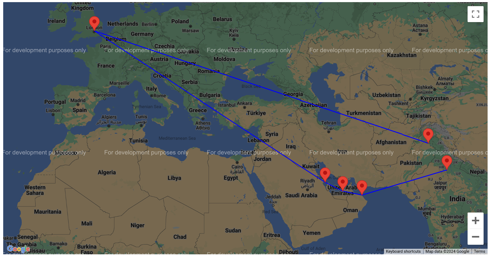

 

   
  <h3 align="center">Optimized Travel Route Planner</h3>

  

     <em>The optimal travel route planner between two countries via flights, trains or buses, based on two options, ie, the fastest or the cheapest.</em>
     
     
  

## Built With

 

## Specifications

- Optimized travel route plan
- Implements Dijkstra's Algorithm
- Uses Graph data structure
- Flight, train & bus Routes
- Fastest or cheapest preference

## Implementation

- CMake build system used
- Takes two countries as an input
- Generates an .html file displaying the path
- Data for routes and cities are taken through .csv file
- Graph holds location as nodes and routes as edges
- Dijkstra's algorithm determines the shortest path between the origin and destination